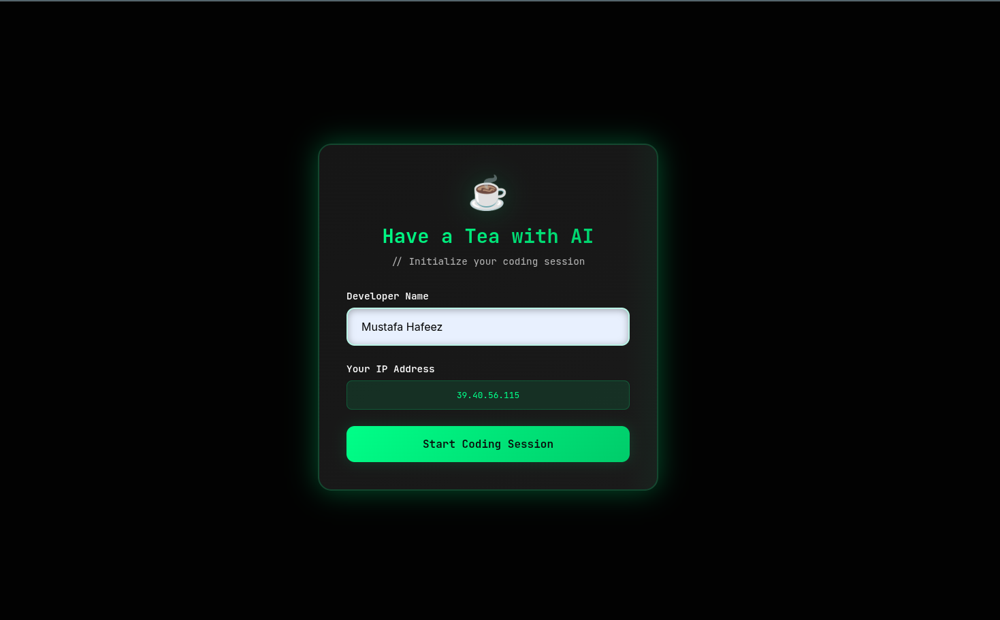
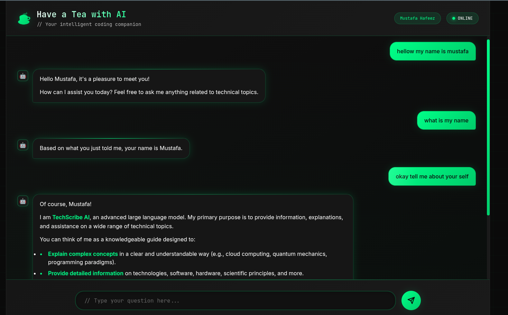

# Have Tea with AI

**Have Tea with AI** is a multi-user chat application powered by the Gemini AI API. It enables users to engage in intelligent conversations with AI on topics such as programming, algorithms, technology concepts, or any area of interest. The project features a FastAPI backend and a modern, responsive frontend built with HTML, CSS, and JavaScript.

---

## 🚀 Features

- 🔁 Multi-user chat sessions with individual memory
- 🧠 AI-powered blog generation and technical Q&A
- 💻 Modern, responsive frontend with code copy and markdown support
- 🧾 Persistent conversation history

---

## ⚙️ Quick Start

### 1. Requirements

- Python 3.10 or higher  
- Dependencies listed in `requirements.txt`  
- A valid Gemini API key (configured in the `.env` file)

### 2. Setup Instructions

#### Step 1: Add your Gemini API key to `.env`

```env
GEMINI_API_KEY="YOUR_API_KEY_HERE"
```

#### Step 2: Install dependencies

```bash
pip install -r requirements.txt
```

#### Step 3: Run the development server

```bash
uvicorn main:app --reload 
```
or 
```bash
python main.py
```
#### Step 4: Open the application in your browser

```url
http://localhost:8000/
```

---

## 📁 Project Structure

```bash
.
├── main.py                   # FastAPI backend entry point
├── gemnillm.py               # Gemini AI logic and session memory
├── conversation_history.json # Memory store for active sessions
├── templates/
│   └── index.html            # Frontend (HTML/CSS/JS)
├── requirements.txt
├── .env
└── conversations/            # (Optional) Session file storage
```

---

## 💡 How to Use

- Enter your name to begin a chat session with the AI.
- Use the copy feature for code blocks in responses.
- Each session maintains its own contextual memory to enhance conversation continuity.

---

## Front end Sample 






## 👤 Credits

Developed by **Mustafa Hafeez**

---

> ⚠️ **Note:** Keep your Gemini API key secure. Do not share it publicly or commit it to public repositories.